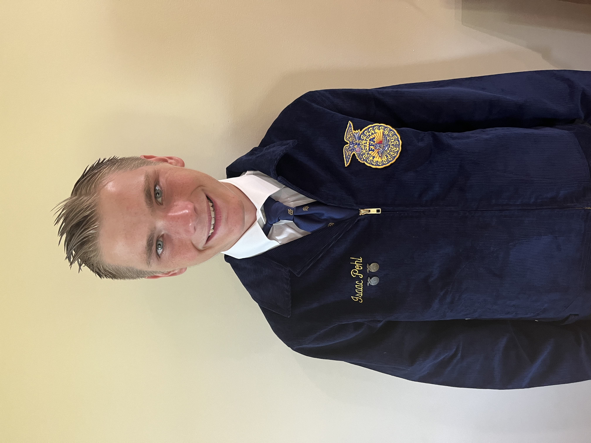

# Isaac Pohl
## Email - isaacpohl0@gmail.com
## Linkedin - www.linkedin.com/in/isaac-pohl/
Hello, my name is Isaac Pohl, and I am a freshman at Murray State University, where I am pursuing a computer science and agriculture degree. I enjoy computer science because it is challenging and offers many opportunities to learn, which is essential in developing the mindset of a successful person. Currently, I am employed at Pohl's Ag Services, a company that helps farmers analyze crop yields. Two summers ago, I helped design and implement a leaf sample record-keeping database, and this past summer, I was in charge of managing and collecting data for this database. In January 2024, I got an internship for Parrish Consulting, Inc., where I designed web applications and databases to keep track of records. For this internship, I learned C# programming and programming techniques. Working for two jobs, Pohl Ag and Parrish, was challenging during the summer. My unique interests and experience in both industries will allow me to help advance the agriculture and computer science industries. I am always looking for ways to volunteer in the community. During this past summer, I organized a team teghter. I got Corteva Agricecnce and National 4-H to sponsor to teach over 600 kids about world hunger and how to grow their food through a presentation and microgreen grow lab. I am currently planning a mission trip and adult program for the next stage of my project. 

# Goals
I plan to graduate Murray State University with a bachelor's degree in computer science and agricluture at Murray State University. After college my goal is to obtain a computer science and agrilcuture job working either remotely or locally. My main goal is to make the world a better place from small everyday interacters, jobs, or community service. After college, I would like to get a job that allows me to continue my passion for agricluture and computer science while still allowing me to porsue my passion for comunity service. 

# My Hobbies 
* Ice Cream Hobbyist
* Working on old vehicle's
* Water Sports
* Exercising
* Raising Rabbits For 4-H
* Growing Plants

# High School Sports 
* Cross Country
* Track and Field

# College Clubs 
* Murray State Collegiate 4-H Club	
* Murray State Agronomy Club
* ATO Fraternity Pledge

# Programming Skills
*   WPF Wizard Application
*   ASP.NET CORE WEB API with Controller and Simple
*   Mockup Data using Mockaroo
*   Serlog Logging
*   Simple Network Managment Protocol (SNMP) V2 and V3 - monotoring devices
*   Python Development
*   Microsoft Blazer Devlopment (c#)
*   HTML5/CSS/JS
*   MariaDB and Microsoft SQL Server
*   Node.js
*   Android App Devlopment (Java)
*   Micrsoft Services Programs/ Automation
*   C# Console App

# Jobs
## Pohl's Ag Services (2020-present)
I was in charge doing 2023 summer to collect leaf samples for various farmers. After collecting 12 weeks of data for each corn and soybean field, I was in charge of creating a database for father anylsasis of how nutrients results to yields specially with certain nutrient and chemical trails. For this database I decided to use Micrsoft Access which was a introduction level of software that allowed me to clean and devleope basic sql commands. This worked well esspecially with graphs. This database was used the next season of 2024 whenever I went to collect leaf samples again. Click here to see graphs and simple data. For this I also had to clearn the proper stages of corn and soybeans to record in database correctly. Click on the cards below to learn more.

## Parrish Consulting Services (Juanary 2024-present)
I started this internship in Juanuray 2024, during this interneship I had to learn Micrsoft Blazor and learn the C# language. During this August 2024

## Pohl's Greenhouse
I started in 2020 a small hobby greenhouse where I grew plants for my family. Over the years, I expanded my company. I learned some of the most important life lessons while working on this business. In 2022, I grew and sold $700 worth of plants, this year I sold $900 worth of plants. Below is my SAE proficiency award application which I received 1st placed at the State FFA Convention.

## Pohl's Farms(2019-2023)
This was my very first job. My brother also worked for the farmer (Steve Pohl) in years past. Steve is related to my family (my Dad's Cousin). I was very determined to prove myself by showing up to work on time and working my hardest. This job was tough and included cleaning grain bins out, taking down buildings, feeding hogs, shoveling gravel, moving water containers, farming and many other duties. This job was very stressful. I was 15 years old and harvesting the fields with a John Deere Combine. The days required long hours and I couldn't stop to think about what to do because as Steve reminded me countless times each minute wastes hundreds of dollars. Along with harvesting, I operated the grain cart and cultivator.

## Kuester Landscaping(2019-2020)
These are the years in which I worked for a landscaping company. This company was small but required hard work and dedication especially on hot days. My tasks included push mowing, trimming bushes, picking weeds, and helping decide on landscaping needs for the customer. One important thing which I learned from this company is that as a business owner you need to put customers first.

## Pohl's Pumpkin
This is also my other business which I started in 2015. At first I grew pumpkins on a 1/4 acre plot in my parents' garden. In 2020, I decided to partner up with my cousin, this allowed us to grow pumpkins on a 1 acre plot at his house. We quickly opened up a website and facebook page for advertisement. In 2023 we decided to stop growing pumpkins since my cousin Ezra was going to college.

# My Awards
1. Gibson Southern High School Future Farmers of America Organization
- FFA Junior Scholar Award: Given by Purdue University (most recognized junior for my accomplishments)
- Biggest Growth FFA Award: (FFA member who improved the most over the 2022 and 2023 school year)
- FFA Outstanding Accomplishment Award 2023: (FFA member who successfully participated in most activities)
- National FFA Proficiency Award Top 4 In Nation: (prestigious award for competing in the nursery operation business) The process consisted of attending workshops, conventions, interviewing, and writing the application.
- Greenhand Degree and Chapter Degree: This degree was earned by completing so many activities in FFA
- State FFA Degree
- State Star Farmer Finalist

