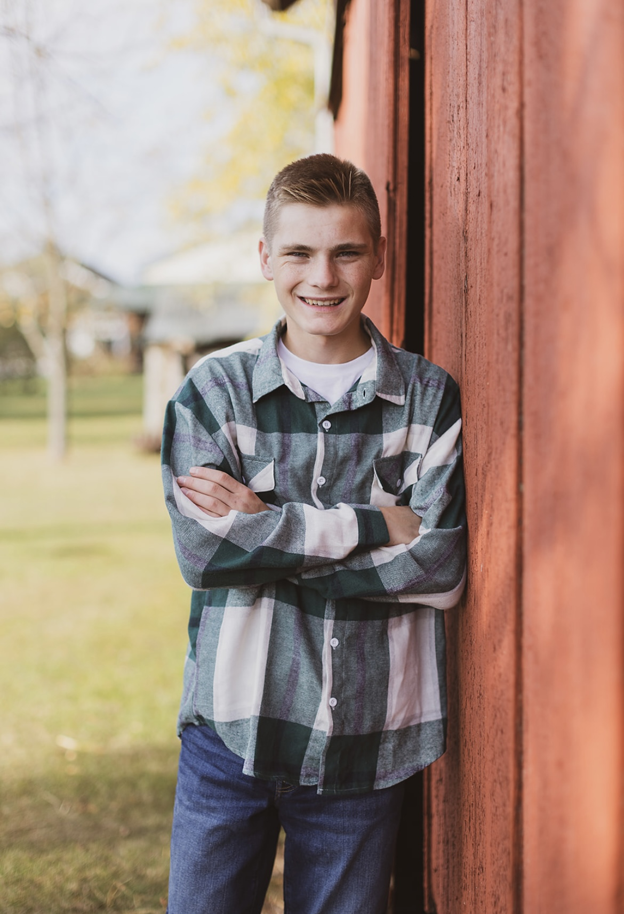

#  Isaac Pohl  

 **Email:** [isaacpohl0@gmail.com](mailto:isaacpohl0@gmail.com)  
 **LinkedIn:** [linkedin.com/in/isaac-pohl](https://www.linkedin.com/in/isaac-pohl/)  

---

## About Me  
Hello! My name is **Isaac Pohl**, and I am a sophomore at **Murray State University**, pursuing a dual degree in **Computer Science** and **Agriculture**.  

I enjoy computer science because it challenges me to think critically and continuously learn—skills that are essential for success. My passion lies in blending **technology and agriculture** to create innovative solutions that help farmers and communities thrive.  

This past year, I have:  
- Interned at the **Vanderburgh Purdue Extension Office**, creating engaging youth programs.  
- Worked at **Pohl’s Ag Services**, designing a database for crop yield analysis.  
- Served as a **Full-Stack Intern at Parrish Consulting**, where I developed web applications and databases using **C#** and **Blazor**.  

I also value **community service and leadership**. I organized a team project with **Corteva Agriscience** and **National 4-H**, teaching over **1,500 students** about world hunger and sustainable farming practices.  

  

---

##  Goals  
- Graduate from Murray State with a **Bachelor’s in Computer Science and Agriculture**.  
- Build a career combining **agriculture and technology**.  
- Use my skills to make a positive impact—through **daily interactions, meaningful work, and community service**.  

---

##  Hobbies  
-  Ice Cream Enthusiast  
-  Restoring Old Vehicles  
-  Water Sports  
-  Exercising  
-  Growing Plants  

---

##  College Involvement  
- Murray State Collegiate 4-H Club  
- Murray State Agronomy and Drone Club  
- Alpha Tau Omega Fraternity – *Social Service Coordinator*
- Omicron Delta Kappa Treasurer (2025)
- Murray State Running and Pickle Ball Club (2025)

---

##  Programming Skills  
- **Languages & Frameworks:** C#, Python, Java, JavaScript, HTML5/CSS, Node.js  
- **Frameworks & Tools:** WPF, ASP.NET Core, Microsoft Blazor, Android Development (Java)  
- **Databases:** MariaDB, Microsoft SQL Server  
- **Other Skills:** Serilog Logging, SNMP (v2/v3), Microsoft Automation Services, Mockaroo Data  

---

##  Work Experience  

###  Vanderburgh County Exension Office (2025 Summer)  
- Led education and outreach programs to educate youth about Health, Agricluture, and STEM.
- Helped plan and led certain 4-H and fair related activities

###  Pohl’s Ag Services (2020–present)  
- Collected & analyzed corn/soybean leaf samples.  
- Designed a Microsoft Access database for yield analysis.  
- Applied agronomy knowledge to ensure accurate data collection.  

###  Parrish Consulting (Jan 2024–present)  
- Full-stack intern working with **C#** and **Blazor**.  
- Designed and connected databases to front-end web applications.  

###  Pohl’s Greenhouse (2020–present)  
- Founded and grew a small greenhouse business.  
- Increased revenue from **$700 (2022)** to **$900 (2023)**.  
- Earned **1st place at State FFA Proficiency Award**.  

###  Pohl’s Farms (2019–2023)  
- Operated combines, grain carts, and cultivators.  
- Gained hands-on experience in livestock care & crop production.  

###  Kuester Landscaping (2019–2020)  
- Worked on mowing, trimming, and landscaping design.  
- Learned the importance of customer service and teamwork.  

###  Pohl’s Pumpkins (2015–2023)  
- Started a pumpkin business at age 10.  
- Expanded to a 1-acre operation with marketing via website/Facebook.  

---

##  Awards & Achievements  

### FFA  
- **FFA Junior Scholar Award** (Purdue University)  
- **Biggest Growth Award** (2022–2023)  
- **Outstanding Accomplishment Award** (2023)  
- **National FFA Proficiency Award** – *Top 4 in Nation (Nursery Operations)*  
- **Greenhand & Chapter Degrees**  
- **State and American FFA Degrees**  
- **State Star Farmer Finalist**  

---

### 4-H  
- **2024 Senior Achievement Award**  
- **2024** – Selected to Attend the *4-H Ignite Conference* in Washington, D.C.  
- **2024** – *Citizenship & Civic Education and Leadership County Winner*  
- **2023 4-H Achievement County Award Winner** – Recognized for 9 years of leadership and involvement in Vanderburgh County 4-H.  
- **2023** – *4-H Aerial Ag Innovators: #1 Teacher in Indiana*  
- **2022 & 2023** – *FFA Junior Scholar Award* (Purdue University recognition)  
- **2016 4-H Junior Achievement County Award Winner**  

---

### Vanderburgh County World Hunger Advocate Group  
For the past **two years**, I have led an outreach program addressing **world hunger solutions at the household level**.  

- Designed a youth education program on growing superfoods (microgreens, sprouts).  
- Secured funding through the **National 4-H Lead to Change Grant** and a grant from **Corteva Agriscience**.  
- In **Summer 2024**, led a **team of 5** to reach **1,500+ people** across schools, camps, assisted living facilities, and fairs.  
- In **Summer 2025**, organized a **mission trip** with **11 4-H members** to **David, KY** (a food desert in Floyd County, where 26.6% of residents live below poverty).  
- Activities included microgreen education, installing a garden bed, maintaining local gardens, and assisting at a food pantry.  

This experience was invaluable in raising awareness about food insecurity and empowering youth to take action.  

---

### 4-H Aerial Ag Innovators  
- Selected as **1 of 4 in Indiana** to attend a 3-day program at **Ohio State University** on **precision agriculture and drones**.  
- Tasked with teaching **10,000+ Indiana students** about drones and precision agriculture.  
- Developed hands-on lessons: flying Tello drones, robotics activities, and interactive presentations.  
- Recognized as the **Top Instructor in Indiana** and awarded a drone for teaching the most students.  

---

### Alpha Tau Omega – Social Service Coordinator  
- Member of the **Alpha Tau Omega Zeta Lambda Chapter** at Murray State University.  
- As **Social Service Coordinator**, I organize, promote, and track service opportunities for fraternity members.  
- Since taking office, I have increased service opportunities to **~2 per week** (compared to 1 per week previously).  
- Projects include:  
  - Volunteering at food banks  
  - Cleaning Main Street in Murray  
  - Building beds for *Sleep in Heavenly Peace*  
  - Maintaining Kentucky Lake trails  
  - Volunteering at the animal shelter  

---

### Omicron Delta Kappa – Treasurer  
- Member of the **Omicron Delta Kappa Honors Society** (top **35% of class** required for membership).  
- Focus areas: **Leadership, Community Service, Academics**.  
- Serve as **Treasurer** and **Social Service Coordinator** for the Murray State chapter.  
